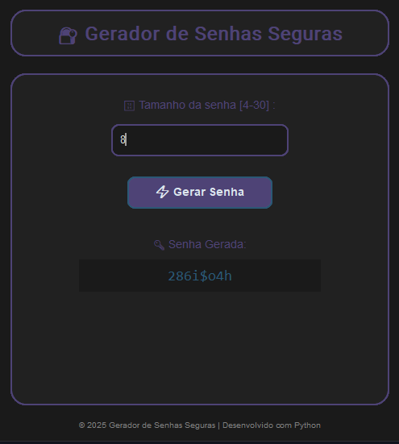

# 🔐 Gerador de Senhas

Um pequeno gerador de senhas aleatórias com suporte a letras, números e símbolos. O projeto conta com uma interface gráfica simples e intuitiva feita em *Tkinter* e *CustomTkinter*.

---

## 📸 Demonstração (opcional)



---

## 🚀 Funcionalidades

- Geração de senhas aleatórias seguras.
- Opção de escolher o tamanho da senha desejada.
- Interface gráfica amigável para fácil interação.

---

## 🛠 Tecnologias Utilizadas

- Python
- Tkinter (interface gráfica)
- CustomTkinter (estilo moderno para Tkinter)
- Random (geração de senhas aleatórias)

---

## 🧩 Como Rodar o Projeto

1. *Clone o repositório:*

    bash
    git clone https://github.com/usuario/gerador-de-senhas.git
    cd gerador-de-senhas
    

2. *Instale as dependências:*

    Certifique-se de ter o Python instalado, então execute:

    bash
    pip install -r requirements.txt
    

3. *Execute o programa:*

    bash
    python gerador_senhas.py
    

---

## 📄 Arquivo requirements.txt

Inclua este arquivo na raiz do projeto:

```txt
customtkinter

